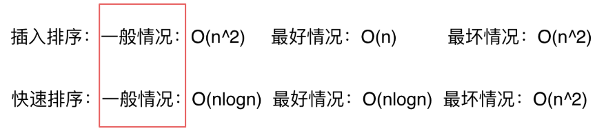
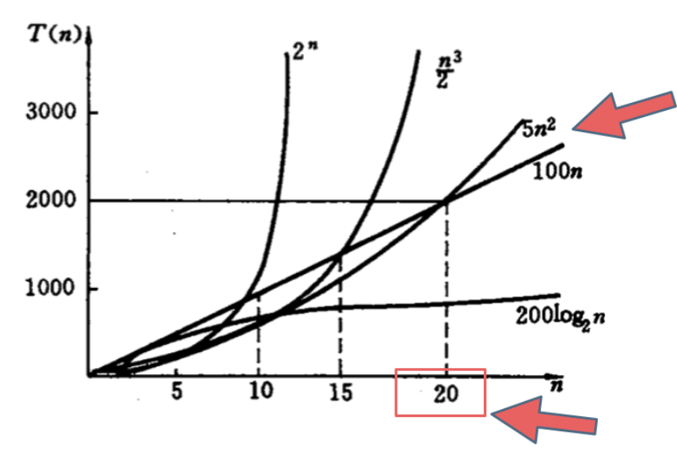

# 01 时间复杂度 O(f(n))
时间复杂度是一个函数，定义算法的运行时间

## 大O任意输入的运行时间上界

## 不同数据规模时，算法的对比

不过，一般情况下：
**O(1)常数阶 < O(logn)对数阶 < O(n)线性阶 < O(nlogn)线性对数阶 < O(n^2)平方阶 < O(n^3)立方阶 < O(2^n)指数阶**

## O(logn)中的log是以什么为底？
log_a(x) = log_b(x)/log_b(a)

反之 log_b(x) = log_a(x)*log_b(a)

因此可以统一改为2为底，变成Log(N)

# 02 算法超时

